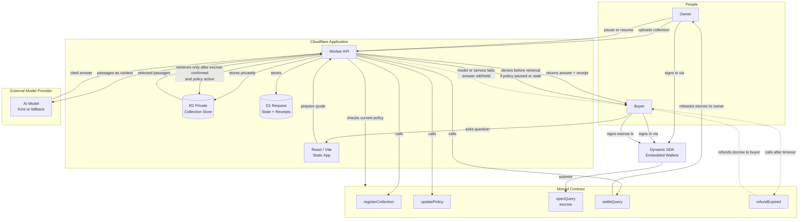
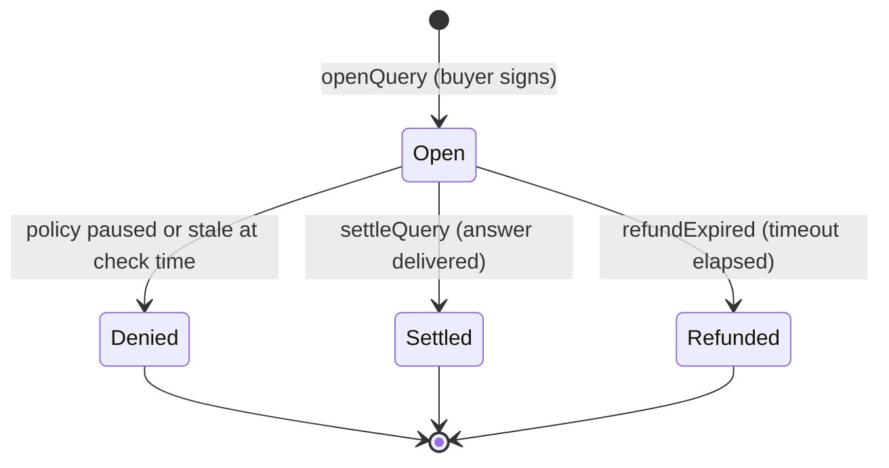

# DataVault Query License: Knowledge Graph

*Source of truth: DataVault-Metropolis-Build-Plan.md. No features added, no scope changed. Open decisions are labelled explicitly.*

---

## 1. Project at a Glance

DataVault Query License is a hackathon prototype that lets an owner upload a private knowledge collection, register a per-query price and policy on the Monad testnet, and receive payment each time a buyer signs an escrow transaction and receives a real AI-generated answer citing passages from that collection. Access is gated through a Cloudflare Worker that verifies on-chain payment and current policy before retrieving any content. The owner can pause access at any time, blocking all future queries through the service. The primary hackathon track is **Trust, Identity & AI Infrastructure** and the priority bounty is the **Dynamic SDK bounty ($5,000)**.

---

## 2. Knowledge Graph

**Legend**
- Solid arrows: core allow path and normal settlement
- Dashed arrows: failure path and refund path

### Escrow State Diagram

---

## 3. Entities and Relationships

| Source | Relationship | Target | Meaning |
|--------|-------------|--------|---------|
| Owner | signs in via | Dynamic | Embedded wallet created; identity linked to wallet address |
| Owner | uploads collection to | R2 (via Worker) | Markdown guide stored privately; never exposed publicly |
| Owner | registers policy on | Monad contract | Collection ID, price, policy version, active status stored on-chain |
| Owner | pauses or resumes via | Monad contract (updatePolicy) | Future queries blocked or unblocked immediately |
| Buyer | signs in via | Dynamic | Embedded wallet created for payment signing |
| Buyer | signs escrow transaction via | Dynamic to Monad (openQuery) | Fixed payment placed in escrow; request ID created |
| Worker | checks current policy from | Monad contract | Verified immediately before any retrieval |
| Worker | retrieves passages from | R2 | Only after escrow confirmed and policy active |
| Worker | sends passages to | AI model provider | Selected passages used as context for real model call |
| Worker | records receipt in | D1 | Request ID, policy version, tx hash, passage IDs, response digest, outcome |
| Worker | calls settleQuery on | Monad contract | Escrow released to owner after successful answer |
| Worker | calls refundExpired on | Monad contract | Buyer reclaims escrow after timeout if answer not delivered |
| Hash stored on-chain | is an integrity reference for | collection content | Confirms content has not changed; does not prove ownership or copyright |
| Dynamic sign-in | proves | wallet ownership | Does not prove identity, content ownership, or legal rights |

---

## 4. End-to-End Sequence

**Owner registration**

1. Owner opens the app and signs in with Dynamic. An embedded wallet is created automatically.
2. Owner uploads a Markdown knowledge collection through the Worker API.
3. Worker stores the collection privately in R2.
4. Worker calls `registerCollection` on the Monad contract, storing the collection ID, owner address, per-query price, policy version, and active status.

**Buyer query**

5. Buyer signs in with Dynamic. An embedded wallet is created.
6. Buyer submits a question. Worker returns a price quote via `POST /api/queries/prepare`.
7. Buyer reviews the quote and signs a Monad transaction through Dynamic, calling `openQuery` with the fixed payment in escrow and a unique request ID.
8. Worker verifies the transaction is confirmed and the escrow amount matches the registered price.
9. Worker reads the current policy from the Monad contract. If the collection is paused or the policy version has changed, the request is denied before any retrieval.
10. Worker retrieves relevant passages from the private R2 bucket.
11. Worker sends those passages as context to the chosen AI model provider and receives a cited answer.
12. Worker records the request in D1 with the request ID, collection and policy version, payment transaction hash, cited passage IDs, response digest, and outcome.
13. Worker calls `settleQuery` on the Monad contract, releasing escrow to the owner.
14. Worker returns the cited answer and a link to the receipt to the buyer.

**Failure path**

15. If the model call or Worker fails, the answer is withheld and no settlement is triggered.
16. After the timeout elapses, the buyer calls `refundExpired`. The contract returns the escrowed payment to the buyer.

**Revocation**

17. Owner calls `updatePolicy` with `active = false`.
18. All subsequent queries are denied at step 9 before any retrieval occurs.
19. Answers already delivered are not affected and cannot be erased.

---

## 5. Contract and API Map

### Smart Contract Methods (Solidity on Monad testnet)

| Method | Responsibility |
|--------|---------------|
| `registerCollection` | Store collection ID, owner address, per-query price, policy version, and active status |
| `updatePolicy` | Update price and active status; increment policy version |
| `openQuery` | Accept escrow payment and create a request record with a unique request ID |
| `settleQuery` | Release escrowed payment to the owner after successful answer delivery |
| `refundExpired` | Return escrowed payment to the buyer after the timeout if answer was not delivered |

*Note: arguments and response schemas beyond those stated in the plan are not specified here.*

### Worker API Routes

| Route | Method | Responsibility |
|-------|--------|---------------|
| `/api/collections` | POST | Register a new collection, trigger on-chain registration |
| `/api/collections/:id/upload` | POST | Upload collection document to private R2 bucket |
| `/api/queries/prepare` | POST | Return price quote for a given collection |
| `/api/queries/execute` | POST | Verify payment, check policy, retrieve passages, call model, settle escrow, store receipt |
| `/api/queries/:id/receipt` | GET | Return the stored receipt for an executed query |

*R2 public URLs are never exposed. Model and settlement credentials are stored in Worker secrets. Prompts, source passages, and answers are not stored on-chain.*

---

## 6. Trust Boundaries and Non-Claims

**What is recorded on Monad:**
Collection ID, owner address, per-query price, policy version, active status, request ID, escrow state, and receipt commitment.

**What is kept off-chain:**
Prompts, source passages, AI-generated answers, and collection document content.

**What Dynamic authentication proves:**
That the signing party controls the wallet. It does not prove real-world identity, content ownership, or any legal right.

**What a content hash proves:**
That the registered collection has not been altered since registration. It is an integrity reference only. It does not prove copyright ownership, permission to use content, confidentiality, or legal compliance.

**What the model provider sees:**
Selected passages retrieved from R2, sent as context for the query. The model provider is a third party. Owners are told this explicitly before upload.

**What revocation cannot undo:**
Answers already delivered to buyers, any copies made by the buyer, and any downstream use of those answers.

**What this product does not claim:**
- Detection of AI use of content outside this service
- Forcing unrelated AI companies to pay
- Proof of copyright or ownership via on-chain registration
- Production readiness
- Legal compliance certification

---

## 7. Acceptance and Failure Cases

| Case | Expected Behaviour |
|------|--------------------|
| Successful query | Buyer signs escrow, policy is active, passages retrieved, real model called, cited answer returned, escrow settled to owner, receipt stored |
| Collection paused | Worker checks policy, finds active=false, denies request before any retrieval, escrow not yet opened or refunded based on timing |
| Stale policy version | Worker detects policy version mismatch, denies request before retrieval |
| Replay attack | D1 request ID uniqueness check blocks duplicate execution of the same request ID |
| Insufficient payment | Worker rejects at payment verification step, before any retrieval |
| Model or service failure | Answer withheld, settlement not triggered, buyer can call refundExpired after timeout |
| Worker timeout | Same as model failure path |
| Settlement failure | Retry logic applied; if unresolved, escalate to refund path |
| Expired refund | Buyer calls refundExpired after timeout, contract returns escrowed payment |

---

## 8. Timeline and Ownership

| Dates | Milestone | Owner |
|-------|-----------|-------|
| Oct 3-4 | Feasibility gate: confirm Cloudflare access, Dynamic sign-in and signed Monad tx, contract deployment, real model access; write demo collection; get feedback from three likely users | Both |
| Oct 4-6 | Payments and gate: escrow contract, Worker API, R2 storage, D1 state, policy checks, payment verification | Tanvir |
| Oct 6-8 | Working product: owner and buyer screens, Dynamic auth and wallet signing, real model retrieval with citations, receipt history | Both |
| Oct 9-10 | Failure paths: revocation, stale policy, replay, insufficient payment, model failure, Worker timeout, settlement failure, expired refund | Tanvir leads; Ritik tests |
| Oct 11-12 | Public demo and freeze: deploy site and contract, publish setup instructions, run complete flow from clean browser, capture real demo, write Dynamic bounty submission description | Both |
| Oct 13-14 | Submission buffer: check every portal field, submit before Oct 14 04:59 GMT+1 | Both |

**Tanvir owns:** Solidity contracts, Worker API, R2 and D1 integration, payment state machine, security checks, AI model integration.

**Ritik owns:** React frontend, Dynamic sign-in flow, owner and buyer UX, demo video editing.

**Freeze date:** October 12. Submit early, before the displayed deadline.

---

## 9. Open Gates

These items are conditional or unverified as of the plan date. Do not treat them as resolved until explicitly confirmed.

| Gate | Decision Required |
|------|------------------|
| Kimi API access | Verify on day 1. If unavailable, switch to another real model provider immediately and make no Kimi bounty claim. |
| Dynamic agent wallet and delegated access on Monad testnet | Verify compatibility before making it a deadline-critical feature. Embedded wallets plus signing is the confirmed baseline. |
| Permitted Monad network for deployment | Confirm which Monad testnet or network the portal allows before deploying the contract. |
| Portal submission requirements | Check every required field in the Metropolis submission portal. The plan notes these must be verified against the actual portal. |
| User feedback gate | Write the demo knowledge collection and get feedback from three likely users by Oct 3-4. Reduce demo scope immediately if any critical integration fails at the feasibility gate. |

---

## Plan Fidelity Checklist

- [x] DataVault described as paid, policy-controlled retrieval through a participating service
- [x] No claim that the system detects AI use of content outside this service
- [x] Hash described as integrity reference only, not proof of ownership or copyright
- [x] No claim that Monad is the only chain where this is possible
- [x] No claim that unrelated AI companies are forced to pay
- [x] Cloudflare described as runtime and storage provider, not a partner
- [x] No Cloudflare Pay Per Use integration claimed
- [x] No production readiness claimed
- [x] Model provider receives selected passages stated explicitly
- [x] Revocation limited to future requests through the service
- [x] Prompts, passages, and answers kept off-chain
- [x] No invented contract arguments, API schemas, or deployment status
- [x] Kimi integration labelled as conditional and unverified
- [x] Agent wallet delegation labelled as a gate to verify, not a committed feature
- [x] All open decisions labelled as open gates, not resolved facts
